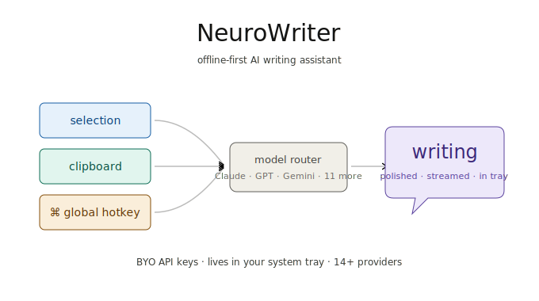

<p align="center">
  
</p>

<h1 align="center">NeuroWriter</h1>

<p align="center">
  An <b>offline-first AI writing assistant</b> that lives in your system tray.
  Hit a <b>global hotkey</b>, send your selection or clipboard to <b>Claude, GPT,
  Gemini</b> (or 11 other providers), and paste the result back — all without
  leaving the app you're in.
</p>

<p align="center">
  
  
  
  
  
  
</p>

Bring your own API keys — none of your prompts, selections, or clipboard
contents leave your machine except the request you explicitly send to your
chosen provider. Chat history is stored locally in IndexedDB.

## Why NeuroWriter

Most AI front-ends are *web tabs*. NeuroWriter is a **desktop launcher**:

- **Global hotkey** — summon a chat window from anywhere without alt-tabbing.
- **Clipboard pipeline** — the last thing you copied is one keystroke away
  from "rewrite this", "translate this", "summarize this".
- **System tray** — quick actions live in your menu bar, not in a browser tab.
- **14+ providers, one UI** — switch models per-conversation. Your key, your
  rate limit, your bill.
- **Offline-first** — settings, conversations, masks, and prompts are stored
  locally. No accounts, no cloud sync.

## Quick start

### Run as a web app (dev)

```bash
yarn install
yarn dev
# open http://localhost:3000
```

### Run as a desktop app (dev)

```bash
yarn install
yarn app:dev
```

### Build production installers

```bash
yarn app:build
# Outputs in src-tauri/target/release/bundle/
```

## Supported providers

Drop an API key into Settings (or `.env.local`) and the provider lights up.
No SDK, no account creation, no telemetry — every request goes browser →
provider directly.

| Provider     | Models exposed                                  | Key var                       |
|---|---|---|
| OpenAI       | GPT-4o, GPT-4, GPT-3.5, GPT-5                   | `OPENAI_API_KEY`              |
| Anthropic    | Claude Sonnet, Claude Opus, Claude Haiku        | `ANTHROPIC_API_KEY`           |
| Google       | Gemini 1.5 Pro, Gemini Flash                    | `GOOGLE_API_KEY`              |
| DeepSeek     | DeepSeek-V3, DeepSeek-Coder                     | `DEEPSEEK_API_KEY`            |
| xAI          | Grok                                            | `XAI_API_KEY`                 |
| Moonshot     | Kimi (long-context)                             | `MOONSHOT_API_KEY`            |
| Alibaba      | Qwen                                            | `ALIBABA_API_KEY`             |
| Baidu        | Ernie                                           | `BAIDU_API_KEY`               |
| ByteDance    | Doubao                                          | `BYTEDANCE_API_KEY`           |
| Tencent      | Hunyuan                                         | `TENCENT_API_KEY`             |
| Zhipu        | GLM                                             | `CHATGLM_API_KEY`             |
| iFlytek      | Spark                                           | `IFLYTEK_API_KEY`             |
| SiliconFlow  | Aggregator (Qwen / Llama / Mistral mirrors)     | `SILICONFLOW_API_KEY`         |
| 302.AI       | Aggregator (pay-as-you-go to anything)          | `AI302_API_KEY`               |

> Add a provider that's not listed via `CUSTOM_MODELS=+provider/model-name`.
> Hide ones you don't want with `-provider/model-name`.

## Features

- **Chat with code blocks** — syntax highlighting, copy buttons, math via
  KaTeX, diagrams via Mermaid.
- **Masks** — reusable system prompts ("Senior code reviewer", "ESL editor",
  "Stand-up summarizer") that you can pin or share via URL.
- **Realtime voice** — Azure realtime-audio for streamed voice chat.
- **MCP tools** — set `ENABLE_MCP=true` to expose Model Context Protocol
  servers as tools your chat can call.
- **Image input** — paste / drag images into a chat; HEIC is converted in
  the browser via `heic2any`.
- **PWA** — install from the browser if you don't want the desktop app.
- **Export anything** — Markdown, PNG, JSON. No vendor lock-in on your
  conversation history.

## Screenshots

> Placeholder — drop screenshots into `docs/screenshots/` and they'll render
> here. Filename suggestions:
> `tray-launcher.png`, `chat-window.png`, `mask-picker.png`, `settings.png`.

<p align="center">
  
  &nbsp;
  
</p>

## Configuration

NeuroWriter reads from environment variables (server-side) and Settings
(client-side, persisted to IndexedDB). The web build expects env vars; the
desktop build can use either.

Common variables (see `.env.template` for the full list):

| Var                  | Purpose                                             |
|---|---|
| `OPENAI_API_KEY`     | Server-side OpenAI key. Required for SaaS deploys.  |
| `ANTHROPIC_API_KEY`  | Server-side Anthropic key.                          |
| `GOOGLE_API_KEY`     | Server-side Gemini key.                             |
| `CODE`               | Comma-separated access passwords for self-hosted.   |
| `PROXY_URL`          | Outbound HTTP proxy (e.g. for region-locked APIs).  |
| `CUSTOM_MODELS`      | Whitelist / blacklist / rename models.              |
| `DEFAULT_MODEL`      | Model to select on new conversations.               |
| `HIDE_USER_API_KEY`  | Prevent users from supplying their own key.         |
| `ENABLE_MCP`         | Enable Model Context Protocol tools (`true`).       |

For desktop, **users typically leave server-side vars empty** and enter
their own keys in Settings — that's the point of BYO.

## Development

### Stack

| Layer              | Tech                                                          |
|---|---|
| Web framework      | Next.js 14 (App Router off — Pages for static export)         |
| Desktop shell      | Tauri 1.5 (Rust)                                              |
| UI                 | React 18 + Sass                                               |
| State              | Zustand                                                       |
| Persistence        | IndexedDB (via `idb-keyval`)                                  |
| Markdown           | `react-markdown` + `remark-gfm` + `rehype-katex`              |
| Diagrams           | Mermaid 10                                                    |
| Search             | Fuse.js                                                       |
| Voice              | `rt-client` (Azure Realtime Audio)                            |
| Tools              | `@modelcontextprotocol/sdk` (optional, behind `ENABLE_MCP`)   |

### Common commands

```bash
yarn dev          # Web dev server (http://localhost:3000)
yarn build        # Standalone Next.js build (for self-host / Docker)
yarn export       # Static export — feeds the Tauri bundle
yarn app:dev      # Tauri desktop in dev mode
yarn app:build    # Tauri installers (.exe / .msi / .dmg / .deb / .AppImage)
yarn lint         # ESLint
yarn test         # Jest in watch mode
yarn test:ci      # Jest single-run for CI
```

### Project layout

```
app/                  Next.js pages, components, stores, providers
  client/platforms/   One file per AI provider (openai, anthropic, …)
  masks/              Mask definitions + build script
  components/         React components (chat, settings, sidebar, mask picker)
src-tauri/            Rust shell, system tray, global hotkey
public/               Static assets, icons, service worker, prompts.json
docs/                 Documentation (screenshots go in docs/screenshots/)
scripts/              Helper scripts (proxy init, prompt fetcher)
```

## Deployment

### Vercel / Zeabur (one-click)

This is a vanilla Next.js app — deploy with the platform's GitHub
integration. Set the env vars from `.env.template`, push to `main`.

### Docker

```bash
docker build -t neurowriter .
docker run -d -p 3000:3000 \
  -e OPENAI_API_KEY=sk-... \
  -e CODE=your-access-password \
  --name neurowriter \
  neurowriter
```

Or `docker compose up -d`.

### Self-host (bare metal)

```bash
yarn install
yarn build
yarn start
# Listens on :3000. Front with nginx for TLS.
```

## Privacy

- **No accounts.** No sign-up flow, no email collection, no cloud sync.
- **No proxying by default.** Your API calls go browser → provider directly.
  The Next.js server is only a proxy when you set `BASE_URL` or run the SaaS
  build with a server-side key.
- **No analytics in the desktop build.** The web `@vercel/analytics` import
  is only active when deployed on Vercel.
- **History is local.** Conversations, masks, settings, and access codes
  live in your browser's IndexedDB (web) or `~/.neurowriter` (desktop).
  Clear browser data → conversations gone.

## Known limitations

- **Tauri 1.5, not 2.** The desktop build is on Tauri v1; mobile (iOS /
  Android) targets aren't wired up. The upstream `ChatGPTNextWeb/NextChat`
  ships iOS as a separate native app.
- **Updater endpoint** in `src-tauri/tauri.conf.json` still points at the
  upstream release feed. Repoint it before publishing your own releases or
  the desktop app will offer upstream updates.
- **Server-side proxy mode** assumes one user per deployment (or one shared
  `CODE`). For real multi-tenant use, swap in your own auth.

## Acknowledgements

NeuroWriter is a fork of [ChatGPTNextWeb/NextChat][upstream] (originally
`Yidadaa/ChatGPT-Next-Web`), with the following changes layered on top:

- Rebranded as **NeuroWriter** with desktop-launcher positioning.
- Added global hotkey, system tray integration, and a clipboard pipeline.
- Removed SaaS / Enterprise / sponsor banners from the UI and README.

All credit for the original chat client, provider integrations, mask system,
and Next.js + Tauri scaffolding goes to the upstream maintainers and
[contributors][upstream-contributors]. MIT licensed.

[upstream]: https://github.com/ChatGPTNextWeb/NextChat
[upstream-contributors]: https://github.com/ChatGPTNextWeb/NextChat/graphs/contributors

## License

[MIT](./LICENSE) — same as upstream.
